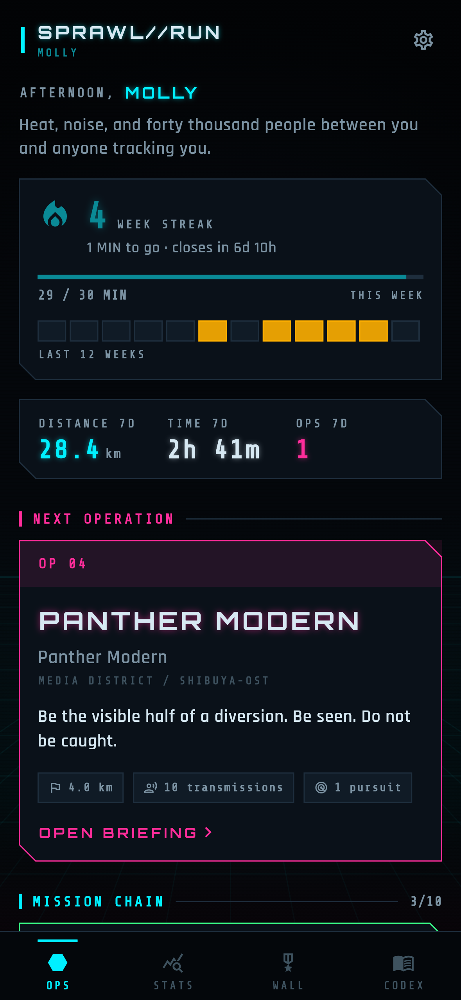
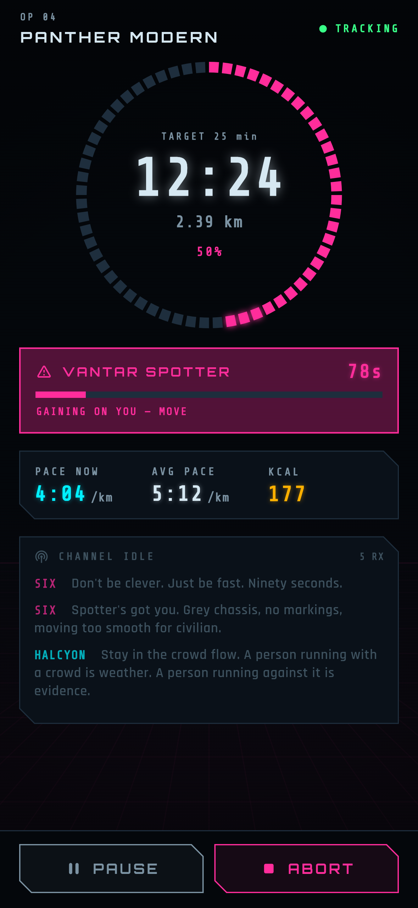
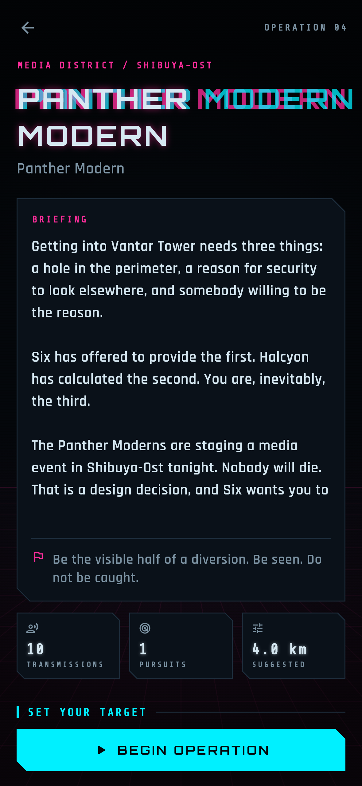
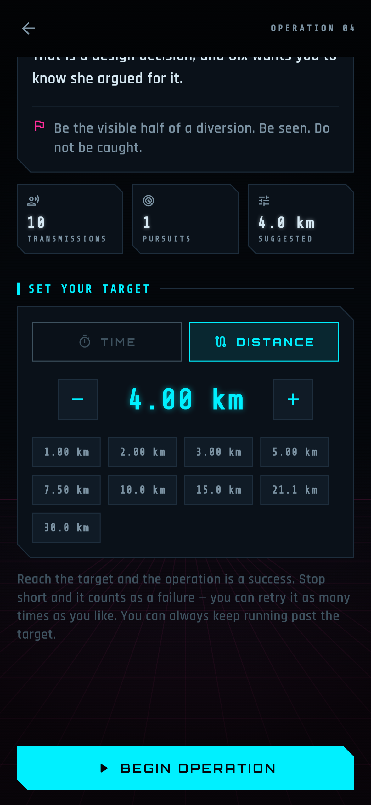
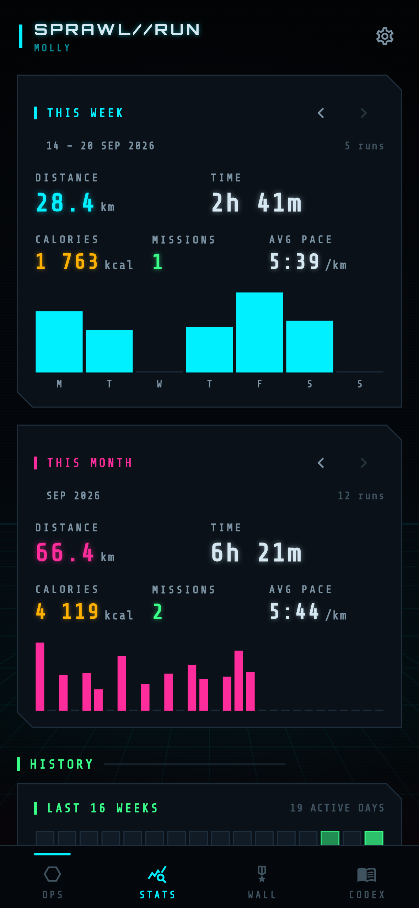
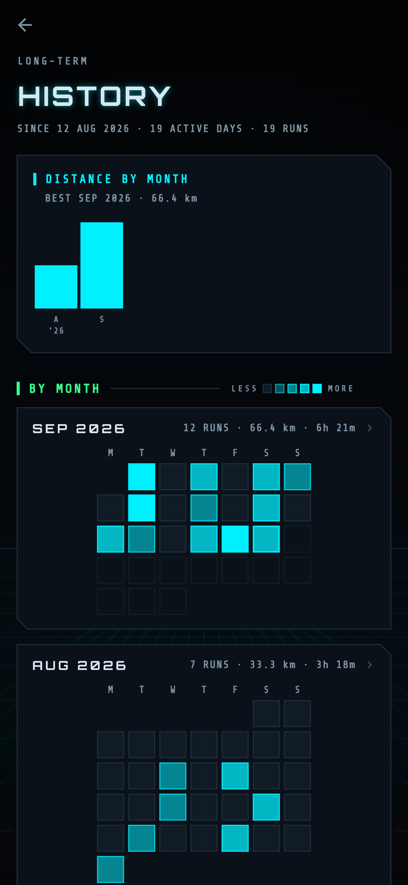
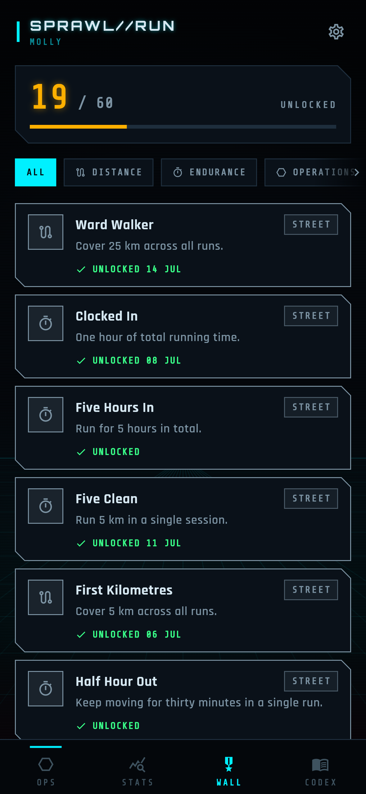
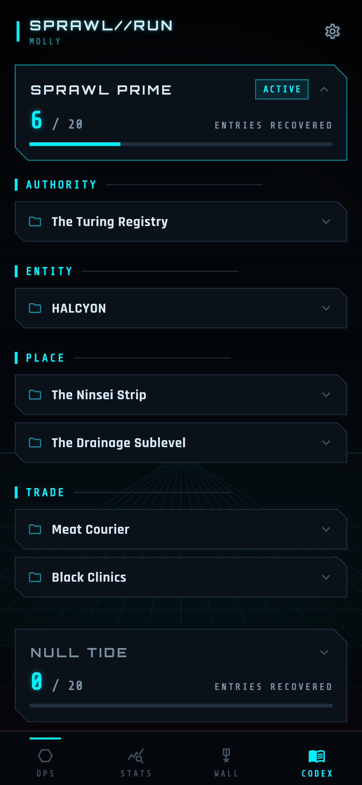

<div align="center">


# SPRAWL//RUN

### Your running app should not be a spreadsheet. It should be chasing you.

Two campaigns, twenty story missions through a rain-slick megacity. GPS-tracked,
voice-acted by your phone, and built around one idea: *somebody is waiting for
you to slow down.*

**Android · Flutter · completely offline · no Google Play Services · no accounts, no ads, no tracking**

<br>

<a href="https://f-droid.org/packages/io.github.jbinder.sprawlrun"></a>
<a href="https://github.com/jbinder/sprawlrun/releases/latest"></a>

<br>





</div>

---

## You are a courier in the Sprawl

A job on the Ninsei strip. One package, no questions. It pays enough to matter
and it is almost certainly a trap.

Twenty minutes later you are running through a drainage tunnel with a
containment shell that will not stop transmitting, and a voice you have never
heard says:

> *"Oh. You are very loud. I mean that kindly. Your heart is the loudest thing
> I have heard in nineteen years, four months, and some days I did not count
> properly. Please do not stop. I am using it to know which way is up."*

Ten missions later you are forty floors up a corporate arcology, and the only
thing keeping an intelligence alive is whether you keep running.

That's **Sprawl Prime**. Finish it and **Null Tide** opens: the southern
districts went under eleven years ago, something in Pump House Seven has been
apologising for nine seconds a night ever since, and a salvage broker with a
bad knee wants a piece of paper carried across the Drowned Mile before the sea
comes home.

---

## Somebody is chasing you

<table>
<tr>
<td width="58%">

A drone tags your gait on Ninsei. Collections kick in a clinic door. A corporate
trace walks the cooling loop toward you.

**You have ninety seconds.**

Here is the part that matters: the chase is scaled to *you*. To escape, you have
to beat your own pace from the last three minutes — not some number a designer
picked. It is a genuine effort whether you run 4:00/km or 7:00/km, and it is
never impossible.

Don't want that? Switch pursuits off. The story still plays.

</td>
<td width="42%"></td>
</tr>
</table>

## You set the target

<table>
<tr>
<td width="42%"></td>
<td width="58%">

Before every mission you choose: a time, or a distance. Twelve minutes or
twenty-one kilometres — **the story paces itself to fit whatever you pick.**

Hit the target and the operation succeeds. Stop short and it fails, stays open,
and you run it again whenever you like.

And if you're having a good day, just keep going. Everything past the target
still counts, and your handler will have something to say about it.

</td>
</tr>
</table>

## The numbers, when you want them

<table>
<tr>
<td width="33%"></td>
<td width="33%"></td>
<td width="33%"></td>
</tr>
<tr>
<td>Distance, time, calories and cleared missions for this week and this month,
with per-day bars and your full run log. Swipe either card to step back through
earlier weeks and months, all the way to your first run. Calories come from the
ACSM metabolic equations and your body mass — no invented multipliers.</td>
<td>The long view: distance per month since day one, and every month as a dot
calendar lit by how far you ran. Tap a month or a day to see the runs behind
it.</td>
<td><b>60 achievements</b> across six categories and four tiers. Progress is
recomputed from your run log every time, so it can never drift out of step with
what you actually did.</td>
</tr>
</table>

**Streaks that don't punish you for Monday.** Pick your own weekly commitment —
minutes, kilometres, or missions. A week still in progress never breaks a
streak; only a finished week that fell short does.

**And it is yours to take with you.** Settings → Data exports everything the app
knows — profile, campaign progress, achievements, codex, and every run with its
GPS trace — as one plain JSON file, handed to the share sheet. Importing it back
either *replaces* this device (a clean restore onto a new phone) or *merges*,
adding runs and progress this device is missing while keeping its own settings.
Merging only ever adds, so bringing in an old backup cannot relock a mission.
No storage permission is involved in either direction: export goes out through
the share sheet, import comes in through the system document picker.

**Single routes travel too.** Any stored run opens onto its map; the share
action there writes the trace as a **GPX 1.1** track, which OsmAnd, Strava,
Komoot or any other map app will open.

## A world worth reading

<table>
<tr>
<td width="58%">

Black clinics. The Turing Registry. Simstim. The service spine of an arcology
that nobody admits exists.

Entries unlock only once a character has actually mentioned them to you — the
codex is a record of what you have been told, not a wiki you can read ahead in.

Forty entries across the two campaigns.

</td>
<td width="42%"></td>
</tr>
</table>

## Everything it does

**Story**
- Twenty missions across two campaigns, paced to the target you pick
- Optional reminders from your handler on the days and at the time you choose,
  written in the voice of the campaign you are playing
- Nine characters across the campaigns, each with its own synthesised voice,
  generated on the device
- Pursuits scaled to your own pace from the last three minutes — or switched off
- A codex of forty entries that unlock only once a character has mentioned them
- Every run keeps a story log; cleared missions open onto a debriefing of every attempt
- Side-loadable mission packs: drop a JSON file in and it appears

**Running**
- GPS tracking that keeps going with the screen off, with auto-pause
- A time or distance target per run, and free runs with no story at all
- Live HUD: distance, pace, elapsed, goal ring, and the pursuit bar
- Calories from the ACSM metabolic equations and your body mass
- Route drawn as a neon trace, replayed at the pace you actually ran it

**Progress**
- This week and this month at a glance, steppable back to your first run
- A long-term history: distance per month, and every month as a dot calendar
- 60 achievements across six categories and four tiers
- A weekly streak you define yourself — minutes, kilometres or missions
- Full run log, grouped by month, with every run's detail and trace

**Audio**
- Your music ducks for a transmission and is forced back if the player sulks
- Optional ambient synth bed for when you bring no music of your own
- Adjustable speech rate and effects volume; story voice can be silenced

**Your data**
- Export and import everything as one JSON file — profile, progress, runs, traces
- Import either replaces this device or merges, and merging can never relock a mission
- Any single route exports as a GPX 1.1 track for OsmAnd, Strava or Komoot
- No accounts, no ads, no analytics, no network permission, no Play Services

---

<div align="center">

### Twenty missions. Two campaigns. 492 lines of dialogue. No network required.

</div>

---

<br>

# Technical

Flutter, targeting Android first with iOS scaffolding already in place. Built
against Flutter 3.44.8 / Dart 3.12.

## Building

```bash
flutter pub get
flutter run                    # debug, on a connected device
flutter build apk --release    # or: flutter build appbundle
```

Grant location when asked. Missions with a **time** target work fine without it;
distance targets obviously do not.

Requires **JDK 17**. Newer JDKs break AGP's `jdkImage` transform, so if your
default JDK is newer, point Flutter at a JDK 17 installation with
`flutter config --jdk-dir <path-to-jdk-17>`.

Release builds are signed from `android/key.properties` — copy
`android/key.properties.example` and fill it in. Without that file the release
APK comes out **unsigned**, which is what F-Droid's build server needs; sign it
yourself before installing one.

Android SDK notes, learned the hard way:

- `path_provider_android` pulls in `package:jni`, which compiles native code, so
  the **NDK is required** (`ndk;28.2.13676358` and `cmake;3.22.1`).
- `android/build.gradle.kts` raises every plugin module to the app's
  `compileSdk`. Several plugins still pin `android-35`, and without this you
  would need every historical SDK platform installed just to build. `minSdk` and
  `targetSdk`, which actually affect runtime behaviour, are untouched.

## Tests

```bash
flutter analyze                # clean
flutter test                   # 228 tests
```

The run engine takes its location source, narrator and clock by injection, so
`test/run_engine_test.dart` plays whole missions against synthetic GPS in
milliseconds — distance filtering, auto-pause, beat ordering, chase adjudication
and degraded-GPS behaviour. `test/campaign_test.dart` validates the shipped story
JSON. The widget tests drive the real screens against real storage.

## Generated assets

Nothing in this repo is a binary of uncertain origin. The sound effects, the
launcher icons and the screenshots above are all produced by code:

```bash
dart run tool/gen_sfx.dart                      # synthesises assets/sfx/*.wav
dart run tool/gen_icons.dart                    # renders every launcher icon
flutter test tool/screenshots/capture_test.dart # regenerates docs/screenshots
```

The screenshot tool drives the real widgets with seeded data, so the images in
this README cannot drift from what the app actually looks like.

## Adding missions

A mission pack is one JSON file. Drop it into the app's documents directory under
`sprawlrun/mission_packs/` and hit **Settings → Mission packs → Reload** — no
rebuild, no app update. See **[docs/MISSION_PACKS.md](docs/MISSION_PACKS.md)** for
the format, and `assets/missions/sprawl_prime.json` or `null_tide.json` for a
worked example.

Every pack is its own campaign with its own chain of missions. The ops screen
shows one at a time; **All packs** lists them all, grouped into active and done,
and finishing the last mission of a pack offers the next one that's still open.

## Layout

```
lib/
  models/       Mission, StoryBeat, RunGoal, RunRecord, Profile, Achievement
  data/         JSON repositories (runs, profile, mission packs) + backup + GPX
  services/     run_engine · narrator · location · stats · energy · achievements
  state/        AppState — the single source of truth the UI reads
  screens/      dashboard · brief · run HUD · summary · stats · history · wall · codex · settings
  widgets/      backdrop · panels · glitch text · rings & bars · route trace
  theme/        palette and typography
tool/           SFX, icon and screenshot generators
```

Some notes on the shape of it:

- **`RunEngine` owns no persistence and no UI.** It consumes a `LocationSource`
  and a `Narrator` and emits state plus an event stream. That is what makes a
  25-minute mission testable in milliseconds.
- **Derived data is always derived.** Stats, streaks and achievement progress are
  pure functions of the run log, recomputed on change rather than maintained as
  counters that can fall out of step.
- **Elapsed time comes from the wall clock**, not from counting timer ticks, so
  backgrounding the app cannot lose time.
- **Distance is filtered, not trusted.** Fixes worse than 35 m accuracy are
  dropped; steps under the noise floor hold the reference point rather than
  advancing it, so slow movement accumulates instead of being thrown away;
  physically impossible jumps are rejected until several in a row suggest the
  device really did move.
- **Auto-pause requires a live GPS.** With no fixes arriving there is no way to
  tell a stopped runner from a lost signal, and freezing the clock would quietly
  ruin a time-based mission.

## Deliberate omissions

- **No maps.** Tiles need a network. Routes are drawn from the stored trace as a
  neon filament on a grid.
- **No accounts or sync.** There is no `INTERNET` permission in the manifest.
  Backups move by hand: exporting hands a file to the system share sheet and
  importing reads one back through the system document picker, so the app needs
  no storage permission and never sees a file you did not choose. The merged
  manifest carries two things it did not ask for directly — `ACCESS_NETWORK_STATE`,
  pulled in by ExoPlayer via `just_audio`, which reads connectivity status and
  grants no network access; and a self-defined
  `…DYNAMIC_RECEIVER_NOT_EXPORTED_PERMISSION` from `share_plus`, which only lets
  the app receive its own share-result broadcast. Without `INTERNET`, nothing
  here could reach the network regardless.
- **`android:allowBackup` is left at Android's default**, which is `true`. That
  means the OS backup agent may copy the run log to the user's Google account if
  they have device backup switched on — the app never does this itself and could
  not, but the data can still leave the device by that route. Setting it to
  `false` would close that path and also disable device-to-device transfer; the
  deliberate choice is to leave the platform behaviour alone and say so plainly
  rather than to claim more isolation than the app actually has.
- **No Google Play Services.** `geolocator_android` declares
  `play-services-location`, which is proprietary. The app module excludes the
  `com.google.android.gms` group so it never reaches the APK, and sets
  `forceLocationManager: true` so the AOSP `LocationManager` is used directly.
  Verified: zero classes under `com/google` are defined in the shipped dex. The
  cost is a slower first fix and marginally worse battery than the fused
  provider; the gain is that the app is free software all the way down and runs
  identically on a de-Googled ROM.
- **No `ACCESS_BACKGROUND_LOCATION`.** Tracking with the screen off works through
  a foreground service, which is the narrower permission and the one Play Store
  review does not treat as a special case. Every run holds one, and it posts the
  ongoing notification counting down whatever target you set — Android requires
  a notification for a foreground service, and it is the honest signal that a
  mission is live. It is the only notification the app ever shows, which is what
  `POST_NOTIFICATIONS` is asked for; refuse it and tracking is unaffected, only
  the notice is hidden. A mission started with no GPS keeps the same service
  under `FOREGROUND_SERVICE_SPECIAL_USE` rather than claiming a location it does
  not have, so a time-target run cannot be frozen in a pocket halfway through
  the story.
- **No heart rate or cadence.** Nothing here needs a strap, and inventing an
  effort metric from GPS alone would be worse than not having one.

## Licences

App code is **[MIT](LICENSE)**.

Bundled fonts are SIL Open Font License 1.1 — Orbitron, Rajdhani and Share Tech
Mono, with their licence texts alongside them in `assets/fonts/`. All audio and
artwork is generated by the scripts in `tool/` and carries the same MIT terms as
the rest of the code.
